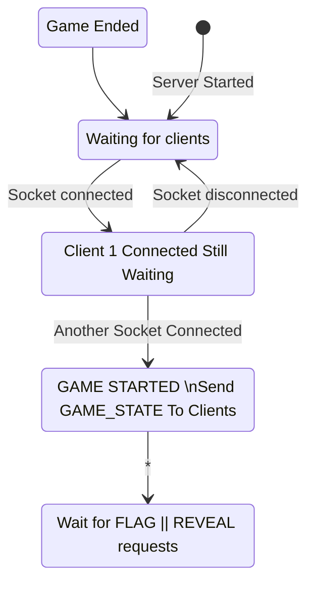
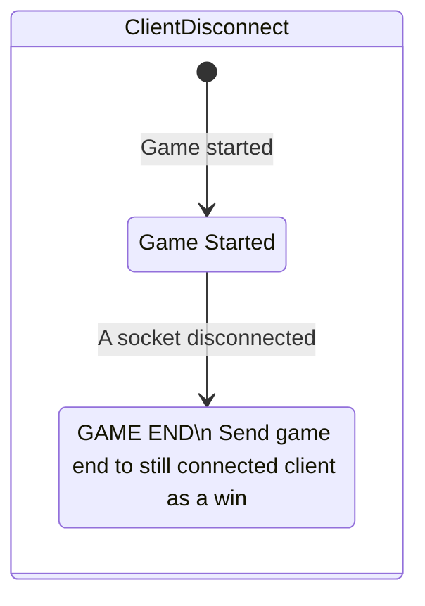
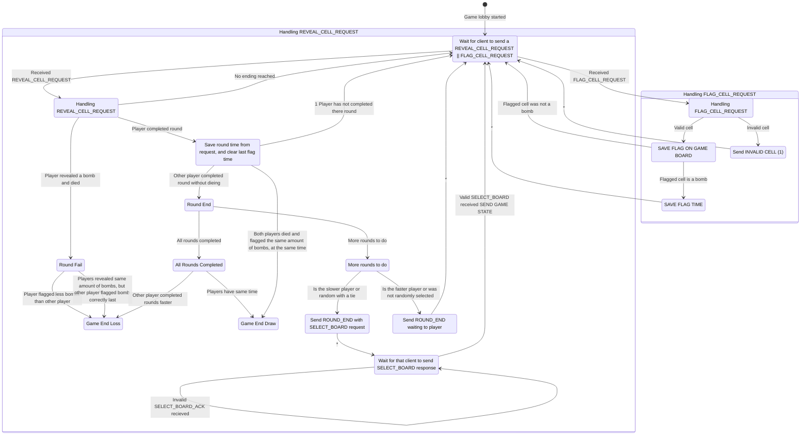
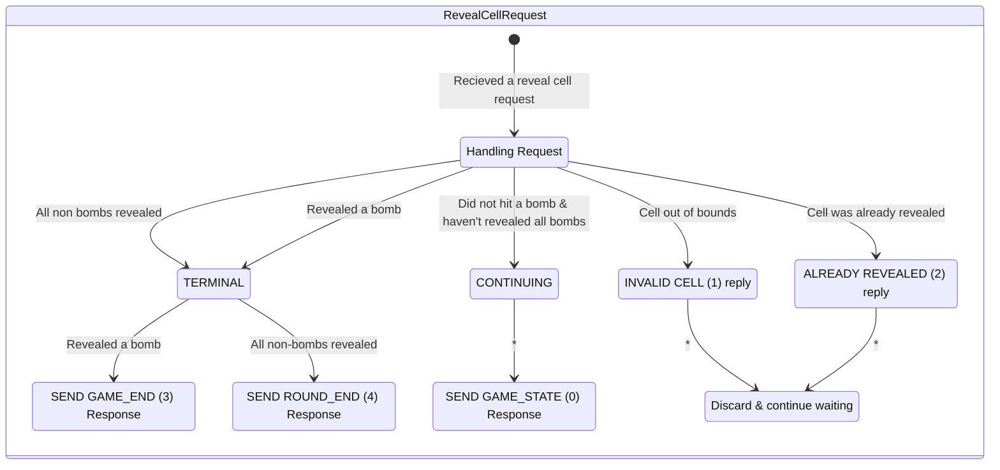
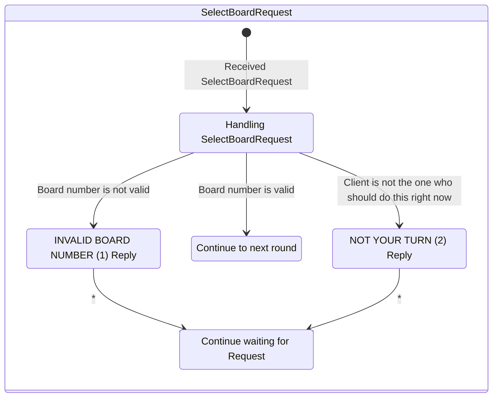
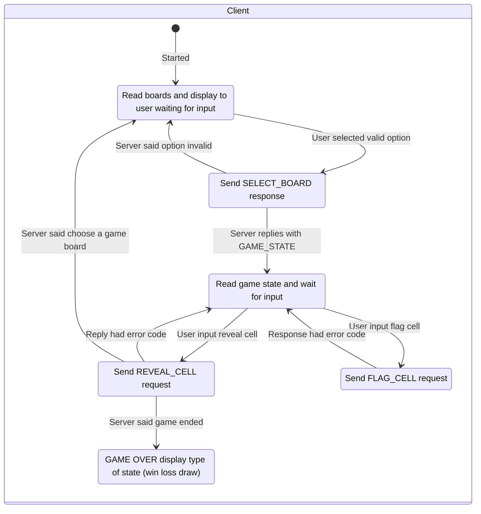

All transitions labeled with * are executed sequentially but shown in a separate not to be more excplict 
### Without splitting these diagrams up, it would be completly unreadable.

# Server side

## Client Disconnect & Reconnect

## Round state machine
Draw & Win/Loss both end the game and send back to the lobby creation (Show in diagram)

# The following is the FSM for each request

# Client  side

If an invalid message type is given or incorrect the server or client responds with UNACCEPTABLE
